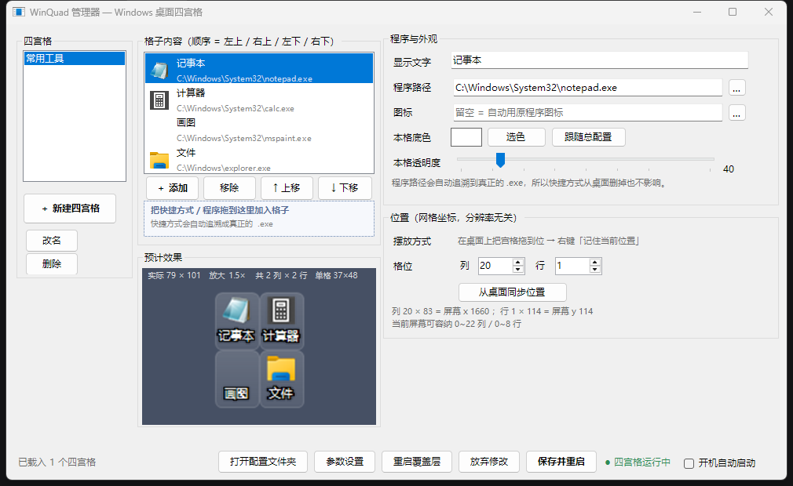
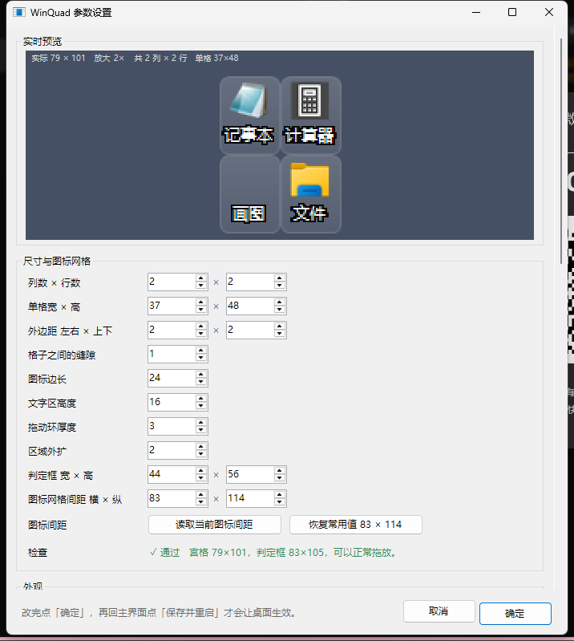

# WinQuad

一个类似安卓「大文件夹」的 Windows 桌面整理组件。

桌面上快捷方式太多、又舍不得删的话，可以拿这个把其中几个收进一个小格子里。
格子默认只占一个图标的位置，里面放四个程序，双击就启动，不弹面板 ——
就是安卓桌面上那种「大文件夹」的做法，搬到 Windows 桌面来。

嫌四个不够，可以让某个格子横着占两格、竖着占两格，里面塞 3×3 共九个。
每个格子占多大、里面分几格，都是**单独设的**，互不影响。

它跟那种浮在桌面上的 Dock 不是一回事。它直接嵌进桌面图标层，和真图标待在同一层，
所以会被窗口正常盖住，按 `Win+D` 的时候还在那儿，不占任务栏，也不会出现在 `Alt+Tab` 里。

作者 Frozen1096 · <https://github.com/Frozen1096/WinQuad>

---

## v0.2

第一个版本之后的第一次大更新。核心是把「一个格子」这个概念做活了。

**每个格子可以有自己的占地和形状**

以前行列数是全局的，改一下所有格子一起变。现在拆成两层，而且都归每个格子自己管：

| | 管什么 | 例子 |
|---|---|---|
| **占地** | 这个格子占几个桌面图标格 | 占 2×2，就是原来四个图标的位置 |
| **形状** | 里面分几列几行 | 里面 3×3，九个程序 |

两层独立，所以「占 2×2 的位置、里面放 3×3」这种组合是可以的。
在管理器右栏「位置」那一块里设。

**格子变大时，图标和文字自动等比放大**

以前格子放大之后图标还是 24px，四周空荡荡的。现在会自动跟着放。
比例取宽高两个方向里**较小**的那个 —— 这样「几个字正好放满一行」这个关系不会变，
不会出现放大之后反而少显示一个字的情况。

**空着的格子彻底透明**

没放程序的位置不再顶着一块半透明底板，整块透出桌面。

**右键菜单补齐了快捷方式该有的操作**

在某个格子上点右键，可以直接「打开文件位置」「属性」（就是资源管理器那个原生属性页），
还有「用 WinQuad 管理器打开配置」。

**文字效果可以调了**

新增投影（右下角垫一层暗色副本，Windows 自己画桌面图标标签用的就是这个手法），
和描边可以叠加使用。参数设置里所有透明度都换成了滑条，边拖边看预览。

**修掉的两个显示问题**

- 图标颜色失真：`Graphics.DrawIcon` 对带 Alpha 的图标处理不可靠，
  有些图标会只剩一片白。换成 `ToBitmap` + `DrawImage` 解决
- 白色文字的笔画末端有彩色花边：那是 ClearType 次像素渲染。
  在离屏位图上显式指定灰度抗锯齿就好了

---

## 在哪验证过

只在作者这一台机器上验证过：Windows 11 / 1920×1080 / 100% 缩放。

换分辨率、换缩放比例、多显示器、别的 Windows 版本都可能出问题。

碰到问题请提 [Issue](https://github.com/Frozen1096/WinQuad/issues)，
带上你的系统版本、复现步骤，还有 `winquad.log` 和 `winquad-manager.log` 这两个日志，
基本能定位。

---

## 关于 Vibe Coding

这个项目全程由 AI 编写：用自然语言描述需求，AI 改代码，没有经过人工逐行评审。

- 功能都实测过，配置读写的回归测试也在仓库里（`--test-config` 和 `--test-save`）
- 但内部实现未必规范，命名、抽象层次、注释密度都不统一
- 没有做过安全审计。程序碰系统的操作只有两件：读写自己目录下的 json，
  以及可选的写一条开机自启注册表项。不过它会跨进程读内存（为了拿桌面图标坐标），
  用之前建议自己扫一遍毒，或者翻翻源码
- 不保证长期维护

---

## 下载哪一份

两种打包，功能完全一样，区别只在运行依赖。

| | 轻量版 | 便携版 |
|---|---|---|
| 怎么认 | 有一堆配套文件（`.dll`、`.json`） | 只有两个大 exe |
| 磁盘占用 | 约 490 KB | 约 99 MB |
| 要装别的东西吗 | 要，需要 .NET 10 桌面运行时 | 不用，解压就能跑 |

轻量版要装的运行时在 <https://dotnet.microsoft.com/download/dotnet/10.0> 下，
选 **".NET Desktop Runtime 10.x — Windows x64"**，注意是 Desktop 那个，
不是 ASP.NET 也不是 Console。装好就能双击 `WinQuad.Manager.exe`。

没装的话双击会弹一个英文错误框，提示缺少 `Microsoft.WindowsDesktop.App`，就是这个原因。

轻量版之所以这么小，是因为 .NET 运行时由多个程序共享，程序本身只有 160 KB 左右。
便携版把整个运行时塞进了 exe，体积翻了几百倍，换来的是零依赖。

---

## 功能

**桌面四宫格**

- 嵌在桌面图标层里，不是悬浮窗。会被窗口盖住，`Win+D` 时还在，不占任务栏、不进 `Alt+Tab`
- 格子里的小图标双击直接启动
- 拖进去的 `.lnk` 会自动追溯成真正的 `.exe` 再取图标，所以没有快捷方式小箭头
- 整块可以拖着走，松手吸附到桌面图标网格。拖动把手是最外圈那道细环，内部是启动区，
  两者不重叠，所以拖的时候不会误启动
- 目标位置被别的图标占了，会自动让到最近的空位
- 位置按「第几列第几行」记，不是像素坐标，换分辨率不会跑偏
- 右键某个格子可以直接打开文件位置、看属性，和正常快捷方式一样

**每个格子单独设置**

- 占地：占几个桌面图标格（1×1、1×2、2×2……）
- 形状：里面分几列几行（最多 8×8）
- 底色和透明度：可以整块覆盖总配置

**管理器**

- 三栏布局，支持直接从资源管理器拖放添加程序
- 设置界面顶部有实时预览，改一个数字立刻能看到效果
- 主界面右下角也有当前格子的预览，随形状实时变
- 参数超限会实时报红（比如图标加文字的高度超过格子高度），不用等重启才发现

**配置**

- `config.json` 管全局，`group-*.json` 管每个格子放什么、以及它自己的占地形状
- 以 `_` 开头的字段是注释，程序会忽略。所以可以直接把配置文件发给别人或 AI 帮忙改
- 管理器保存时是就地替换数值，注释和排版会保留（有回归测试守着）

### 图标缩小后可能认不出来

默认格子只有 37×48 像素，图标会被缩到 24×24，只有原尺寸的一小部分。

设计简洁的图标没事。细节多、文字多、靠颜色区分的，缩完容易糊成一团，几个格子看着都差不多。
标签也会被截断，7pt 字号下最多三个汉字。

三种解法，从省事到费事：

1. 把某个格子的「占用」调大（比如 2×2），里面的格子和图标会一起变大，能显示的字也更多
2. 在管理器里把「图标边长」调大、「文字区高度」调小
3. 自己重绘一版小尺寸专用的简化图标，纯色块加一个大字母就够用。
   在管理器里把「图标」那一栏填成你的 `.ico` / `.png` 路径，原程序不用动

---

## 界面

---

## 轻量化

磁盘上确实轻，内存上不算轻，两个数都摆出来。

| 项目 | 实测 |
|---|---|
| 程序本体（轻量版，两个 exe + 依赖 + 配置） | 489 KB |
| 覆盖层内存 | 约 70 MB |
| 管理器内存 | 约 76 MB（只在改配置时开） |
| 其中属于 .NET 运行时的部分 | 约 50 MB |
| 真正属于程序自己的部分 | 覆盖层约 5 MB，管理器约 7 MB |
| 后台进程 | 1 个 |
| 服务 / 驱动 | 0 |
| 安装程序 | 无。解压即用，整个文件夹随便挪 |
| 写注册表 | 只有可选的「开机自启」一项 |
| 写文件 | 只有自己目录下的 json 和两个日志 |

「约 50 MB 属于 .NET 运行时」是实测出来的，不是我估的：编了一个什么都不做的
WinForms 空窗口当基线跑了一遍，它自己就要占 49.5 MB 工作集、8.7 MB 私有工作集。
WinQuad 覆盖层是 69.5 MB，减掉基线就是程序自己的部分。

换成任务管理器里更常用的「私有工作集」看更直观：空窗口 8.7 MB，
覆盖层 13.4 MB，**程序自己约 4.7 MB**。而且连续跑几小时也不涨，没有泄漏迹象。

对内存敏感的话，建议自己实测再决定。

真正省的是别的东西：没有后台服务、没有常驻索引、没有数据库、开机只起一个进程。
图标提取、渲染、布局全走系统 API，没有引入任何第三方库，
这是它能保持在 489 KB 的原因。

---

## 快速开始

详细操作看同目录的 `使用说明.txt`。三步：

1. 双击 `WinQuad.Manager.exe`
2. 底栏「参数设置」→「尺寸与图标网格」→ 点「读取当前图标间距」→ 确定
3. 回主界面点「保存并重启」

第二步别跳过。桌面图标间距每台机器可能不一样，不校准的话拖动吸附会不准。

想开机自动出现，勾上底栏的「开机自动启动」再点「保存并重启」。

---

## 文件说明

| 文件 | 作用 |
|---|---|
| `WinQuad.exe` | 桌面覆盖层本体，需要带 `--overlay` 启动（管理器会帮你做） |
| `WinQuad.Manager.exe` | 管理器，平时用这个 |
| `config.json` | 全局配置 |
| `group-*.json` | 每个四宫格的内容，以及它自己的占地与形状 |
| `使用说明.txt` | 详细操作手册和常见问题 |
| `启动桌面四宫格.bat` | 不开管理器、只把四宫格叫出来时用 |
| `编辑分组内容.bat` | 打开配置目录 |
| `winquad.log` / `winquad-manager.log` | 运行后生成，报问题时带上 |

---

## 命令行

调试用，平时用不上。

| 命令 | 作用 |
|---|---|
| `WinQuad.exe --overlay` | 启动桌面覆盖层 |
| `WinQuad.exe --detect` | 实测当前桌面图标网格间距 |
| `WinQuad.Manager.exe --settings` | 只打开参数设置窗口 |
| `WinQuad.Manager.exe --test-config` | 自检：保存全局配置后注释是否还在 |
| `WinQuad.Manager.exe --test-save <文件名>` | 自检：保存某个四宫格后注释是否还在 |

---

## 许可

GPL-3.0，全文见 [LICENSE](LICENSE)。
